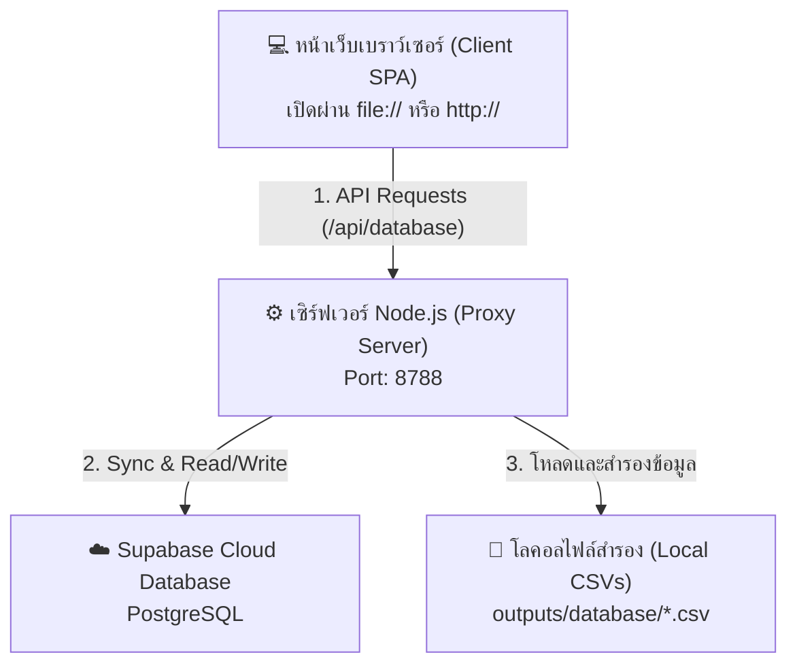

# คู่มืออธิบายโค้ดและสถาปัตยกรรมระบบจัดการทรัพย์สิน (Asset Control Handover Guide)

เอกสารฉบับนี้จัดทำขึ้นเพื่อใช้ในการส่งต่องาน (Handover) สำหรับระบบ **Asset Control** เพื่อช่วยให้ผู้พัฒนาหรือทีมไอทีคนใหม่สามารถทำความเข้าใจโครงสร้าง สถาปัตยกรรมระบบ การเชื่อมต่อฐานข้อมูล และโค้ดในแต่ละไฟล์ได้อย่างละเอียดและเข้าใจง่ายที่สุด

---

## 1. ภาพรวมสถาปัตยกรรมระบบ (System Architecture)

ระบบ Asset Control เป็นเว็บแอปพลิเคชันรูปแบบ Single Page Application (SPA) ที่พัฒนาขึ้นโดยใช้ **Vanilla Javascript (ES6+)**, **HTML5** และ **Vanilla CSS** โดยไม่มีการใช้เฟรมเวิร์กขนาดใหญ่ เพื่อความคล่องตัวและรองรับการเปิดใช้งานแบบโลคอลไฟล์ได้อย่างอิสระ



### การทำแผนที่เส้นทางข้อมูล (Data Flow)
1. เมื่อเบราว์เซอร์เปิดใช้งาน (ไม่ว่าจะดับเบิ้ลคลิกไฟล์ `asset-control.html` โดยตรง หรือเปิดผ่านเว็บเซิร์ฟเวอร์) ตัวแอปจะทำหน้าที่ดักจับสัญญาณคำสั่งดึงข้อมูล (Fetch API Overrides) และแปลงเส้นทางส่งตรงไปยัง **Node.js Local Server (พอร์ต 8788)**
2. เซิร์ฟเวอร์ Node.js ทำหน้าที่เป็นตัวกลาง (API Proxy) ในการติดต่อฐานข้อมูล **Supabase Cloud PostgreSQL**
3. เซิร์ฟเวอร์ Node.js ยังทำหน้าที่เขียนข้อมูลสำรองในรูปแบบไฟล์ CSV ภายในเครื่องคอมพิวเตอร์ด้วย เพื่อป้องกันข้อมูลสูญหาย

---

## 2. โครงสร้างไฟล์ทั้งหมดในระบบ (File Structure)

```text
assets/
├── outputs/                               # แฟ้มบันทึกไฟล์ผลลัพธ์การแสดงผลหน้าเว็บ
│   ├── asset-control.html                 # หน้าแรกและไฟล์ HTML หลักเพียงไฟล์เดียวของระบบ
│   ├── asset-control.css                  # ไฟล์ CSS ออกแบบสไตล์, เลย์เอาต์ และธีมสีทั้งหมด (Light/Dark Mode)
│   ├── asset-control.js                   # ไฟล์รวมมัดสคริปต์ (Bundled JS) สำหรับการนำไปติดตั้งใช้งานจริง
│   ├── asset-control-server.cjs           # เซิร์ฟเวอร์หลังบ้าน (Node.js API Server) เชื่อมต่อ Supabase
│   ├── asset-data.js                      # ไฟล์เก็บ Snapshot ข้อมูลเริ่มต้น (Static Fallback Data)
│   │
│   ├── database/                          # โฟลเดอร์เก็บไฟล์ฐานข้อมูลแบบ CSV สำหรับการสำรองข้อมูลโลคอล
│   │   ├── asset-control-database.json
│   │   ├── users.csv
│   │   ├── otherAssets.csv
│   │   └── loginHistory.csv
│   │
│   └── js/                                # โฟลเดอร์เก็บโค้ดสคริปต์แยกส่วนของการพัฒนา (Development Modules)
│       ├── app.js                         # สคริปต์ทางเข้า (Entry point) เริ่มรันลูปและเรียกใช้ API ตัวแรก
│       ├── auth.js                        # จัดการตรวจสอบสิทธิ์ ล็อกอิน จัดการบัญชีผู้ใช้และรหัสผ่าน
│       ├── data.js                        # จัดการ State หลักของระบบ การแปลงโครงสร้าง และซิงค์ API
│       ├── utils.js                       # ฟังก์ชันผู้ช่วยทั่วไป เช่น ไอคอน SVG, แปลภาษา, ตัวแบ่งสีสถานะ
│       │
│       ├── pages/                         # โฟลเดอร์ย่อยเก็บหน้าการทำงานแต่ละแท็บเมนู
│       │   ├── dashboard.js               # แสดงภาพรวม, ชาร์ตโดนัท และคำขอที่ต้องยืนยัน
│       │   ├── assets.js                  # ตารางแสดงรายการคอมพิวเตอร์และทรัพย์สิน IT ทั่วไป
│       │   ├── maintenance.js             # รายการแจ้งซ่อมและการบันทึกประวัติบำรุงรักษา
│       │   ├── checkout.js                # รายการยืม-คืนอุปกรณ์ และประวัติการอนุมัติ
│       │   ├── master.js                  # ระบบจัดการข้อมูลหลัก เช่น บริษัท, แผนก, สถานะย่อย
│       │   ├── notifications.js           # แสดงประวัติการเข้าใช้งานและกล่องการแจ้งเตือน
│       │   └── settings.js                # หน้าตั้งค่าระบบ, การหมดเวลาเซสชัน และข้อมูลลิขสิทธิ์
│       │
│       └── modals/                        # โฟลเดอร์ย่อยเก็บป๊อปอัปฟอร์มสำหรับสร้าง/แก้ไขข้อมูล
│           ├── asset-modal.js             # หน้าต่างแก้ไขข้อมูลทรัพย์สิน รายละเอียดเฉพาะทางคอมพิวเตอร์
│           └── record-modal.js            # หน้าต่างแบบฟอร์มการทำรายการยืม-คืนอุปกรณ์
│
└── work/                                  # โฟลเดอร์สคริปต์เสริมสำหรับนักพัฒนา
    ├── sync_asset_management.py           # สคริปต์ Python ในการซิงค์ข้อมูล Excel กับ Supabase
    └── build_supabase_sql.py              # สคริปต์สำหรับสร้างตาราง SQL บนฐานข้อมูล Supabase
```

---

## 3. อธิบายการทำงานของโค้ดที่สำคัญแบบละเอียด

### 3.1 ระบบเชื่อมโยงฐานข้อมูลอัตโนมัติ (Fetch API Overrides & API Enablement)
* **ไฟล์:** [data.js](file:///c:/Users/SuphawadiChampathi/OneDrive%20-%20KOCH%20PACKAGING%20AND%20PACKING%20SERVICES%20CO%20LTD/Desktop/assets/outputs/js/data.js) และ [asset-control.js](file:///c:/Users/SuphawadiChampathi/OneDrive%20-%20KOCH%20PACKAGING%20AND%20PACKING%20SERVICES%20CO%20LTD/Desktop/assets/outputs/asset-control.js)
* **กลไกการทำงาน:** เพื่อให้ผู้ใช้สามารถเปิดเว็บแบบโลคอลผ่านการดับเบิ้ลคลิกไฟล์ธรรมดา (`file://`) และยังสามารถส่งข้อมูลบันทึกลงฐานข้อมูล Supabase ได้ตลอดเวลา ระบบจึงทำการตรวจจับโปรโตคอลและแปลงพอร์ต API:

```javascript
// ดักจับคำสั่ง Fetch หากเปิดผ่านไฟล์ HTML บนหน้าจอโดยตรง (file:)
if (window.location.protocol === "file:") {
  const originalFetch = window.fetch;
  window.fetch = function(input, init) {
    // หากเป็นการเรียกใช้ API ภายในระบบ ให้ชี้เป้าไปที่เซิร์ฟเวอร์หลังบ้านเครื่องโลคอล
    if (typeof input === "string" && input.startsWith("/api/")) {
      input = "http://127.0.0.1:8788" + input;
    }
    return originalFetch(input, init);
  };
}
// บังคับให้ระบบมองว่ามี API และทำงานผ่านเครือข่ายตลอดเวลา (ไม่เก็บลง LocalStorage ส่วนตัว)
const DATABASE_API_ENABLED = true;
```

---

### 3.2 ฟังก์ชันคำนวณและแบ่งสีสถานะแยกตามประเภท (Status Color Coding)
* **ไฟล์:** [utils.js](file:///c:/Users/SuphawadiChampathi/OneDrive%20-%20KOCH%20PACKAGING%20AND%20PACKING%20SERVICES%20CO%20LTD/Desktop/assets/outputs/js/utils.js) และ [asset-control.js](file:///c:/Users/SuphawadiChampathi/OneDrive%20-%20KOCH%20PACKAGING%20AND%20PACKING%20SERVICES%20CO%20LTD/Desktop/assets/outputs/asset-control.js)
* **กลไกการทำงาน:** ทำหน้าที่แปลงคำสถานะแต่ละประเภทให้ส่งคืนคลาส CSS ประจำสถานะนั้น ๆ เพื่อให้สีไม่ปะปนกันตามความต้องการล่าสุดของผู้ใช้:

```javascript
function statusClass(status) {
  const value = normalize(status);
  
  // 1. กลุ่มสีเขียว (ใช้งานอยู่ / ทำรายการเสร็จสิ้น)
  if (value === "ใช้งาน" || value.includes("ใช้งานอยู่") || value === "เสร็จสิ้น" || value === "อนุมัติแล้ว" || value === "คืนแล้ว") {
    return "status-green";
  }
  // 2. กลุ่มสีน้ำเงิน (พร้อมทำงาน / ว่างไม่ได้ใช้งาน)
  if (value === "ไม่ได้ใช้งาน" || value.includes("ไม่ได้")) {
    return "status-blue";
  }
  // 3. กลุ่มสีแดง (เกิดปัญหา)
  if (value === "เสีย" || value.includes("ชำรุด") || value === "ปฏิเสธ") {
    return "status-red";
  }
  // 4. กลุ่มสีเหลือง (รอย้ายอุปกรณ์)
  if (value === "รอย้าย" || value.includes("รอย้าย")) {
    return "status-warn";
  }
  // 5. กลุ่มสีม่วง (กำลังซื้อสินค้าใหม่)
  if (value === "ระหว่างสั่งซื้อ" || value.includes("สั่งซื้อ")) {
    return "status-purple";
  }
  // 6. กลุ่มสีส้ม (ส่งไปที่ศูนย์ซ่อมบำรุง)
  if (value === "ส่งซ่อม" || value.includes("ซ่อม")) {
    return "status-orange";
  }
  // 7. กลุ่มสีเทา (ไม่ระบุสถานะ)
  return "status-gray";
}
```

---

### 3.3 ระบบยืนยันรหัสผ่านใหม่สองชั้น (Password Confirm Validation)
* **ไฟล์:** [shell.js](file:///c:/Users/SuphawadiChampathi/OneDrive%20-%20KOCH%20PACKAGING%20AND%20PACKING%20SERVICES%20CO%20LTD/Desktop/assets/outputs/js/shell.js) และ [auth.js](file:///c:/Users/SuphawadiChampathi/OneDrive%20-%20KOCH%20PACKAGING%20AND%20PACKING%20SERVICES%20CO%20LTD/Desktop/assets/outputs/js/auth.js)
* **กลไกการทำงาน:** เพื่อความปลอดภัย ระบบป้องกันการพิมพ์รหัสผ่านใหม่ผิดโดยบังคับให้สร้างฟิลด์ `passwordConfirm` ขึ้นมาในป๊อปอัป และทำการเปรียบเทียบค่าก่อนอัปเดตลงเซิร์ฟเวอร์:

**ในส่วนของ HTML ฟอร์ม ([shell.js](file:///c:/Users/SuphawadiChampathi/OneDrive%20-%20KOCH%20PACKAGING%20AND%20PACKING%20SERVICES%20CO%20LTD/Desktop/assets/outputs/js/shell.js)):**
```html
<div class="field">
  <label>รหัสผ่านใหม่</label>
  <input class="input" data-user-field="password" type="password" value="">
</div>
<div class="field">
  <label>ยืนยันรหัสผ่านใหม่</label>
  <input class="input" data-user-field="passwordConfirm" type="password" value="">
</div>
```

**ในส่วนของฟังก์ชันตรวจสอบสิทธิ์ ([auth.js](file:///c:/Users/SuphawadiChampathi/OneDrive%20-%20KOCH%20PACKAGING%20AND%20PACKING%20SERVICES%20CO%20LTD/Desktop/assets/outputs/js/auth.js)):**
```javascript
function submitUserPassword(idx) {
  const user = DATA.users[Number(idx)];
  if (!user) return;
  
  const newPw = modalValue("[data-user-field='password']");
  const confirmPw = modalValue("[data-user-field='passwordConfirm']");
  
  if (!newPw) { showToast("กรุณากรอกรหัสผ่านใหม่"); return; }
  if (!confirmPw) { showToast("กรุณายืนยันรหัสผ่านใหม่"); return; }
  
  // ตรวจสอบว่ารหัสผ่านทั้งสองช่องตรงกันหรือไม่
  if (newPw !== confirmPw) { 
    showToast("รหัสผ่านใหม่และยืนยันรหัสผ่านใหม่ไม่ตรงกัน"); 
    return; 
  }
  
  user.password = newPw;
  state.modal = null;
  persistLocal();
  render();
  showToast("เปลี่ยนรหัสผ่านเรียบร้อย");
}
```

---

### 3.4 เซิร์ฟเวอร์หลังบ้าน (Node.js Server Backend API Proxy)
* **ไฟล์:** [asset-control-server.cjs](file:///c:/Users/SuphawadiChampathi/OneDrive%20-%20KOCH%20PACKAGING%20AND%20PACKING%20SERVICES%20CO%20LTD/Desktop/assets/outputs/asset-control-server.cjs)
* **กลไกการทำงาน:** เป็น Node.js API Server ขนาดเล็กที่รันบนพอร์ต `8788` โดยทำหน้าที่หลักดังนี้:
  1. **CORS Configuration:** เปิดสิทธิ์การเข้าถึงทรัพยากรข้ามแหล่งกำเนิด (`Access-Control-Allow-Origin: *`) เพื่อยินยอมให้เบราว์เซอร์จากหน้าโปรโตคอล `file://` เรียกใช้งาน API ได้
  2. **Supabase Integration:** โหลดไลบรารี `@supabase/supabase-js` เพื่อซิงก์ตารางข้อมูล `assets` และประวัติยืมคืนขึ้นและลงฐานข้อมูลจริง
  3. **Auto-save to CSV:** ทุกครั้งที่มีการอัปเดตข้อมูล เซิร์ฟเวอร์จะทำการเก็บบันทึกไฟล์ CSV ลงในโฟลเดอร์ `/database/` เครื่องโลคอลทันทีเพื่อเป็นข้อมูลชุดสำรองกรณีฉุกเฉิน

---

## 4. คำแนะนำสำหรับผู้พัฒนาที่จะทำต่อ (Future Handover Guidelines)

> [!NOTE]
> ข้อแนะนำที่สำคัญสำหรับการเปิดใช้ระบบและการทดสอบ

1. **วิธีการเปิดรันเซิร์ฟเวอร์หลังบ้าน (Node.js backend):**
   เข้าสู่เทอร์มินัลโฟลเดอร์โครงการ จากนั้นใช้คำสั่ง:
   ```bash
   node outputs/asset-control-server.cjs
   ```
   *ตรวจสอบให้แน่ใจว่าได้ทำการกำหนดตัวแปรสภาพแวดล้อม (Environment Variables) เช่น `SUPABASE_URL` และ `SUPABASE_ANON_KEY` เรียบร้อยแล้ว*

2. **การอัปเดตโมดูลแยกย่อยเข้าสู่ไฟล์ Bundle หลัก:**
   หากทำการแก้ไขไฟล์เดี่ยวในไดเรกทอรี `js/` (เช่น `js/shell.js` หรือ `js/utils.js`) อย่าลืมคัดลอกส่วนที่แก้ไขเข้าไปในไฟล์รวมศูนย์กลาง [asset-control.js](file:///c:/Users/SuphawadiChampathi/OneDrive%20-%20KOCH%20PACKAGING%20AND%20PACKING%20SERVICES%20CO%20LTD/Desktop/assets/outputs/asset-control.js) ด้วย เพื่ออัปเดตความสามารถให้กับตัวเวอร์ชันมัดรวมเดี่ยว (ถ้ามีแผนนำตัวไฟล์มัดรวมไปใช้งานในระยะยาว)

3. **ข้อควรระวังในการแก้ไขโค้ดตกแต่ง (CSS):**
   การเพิ่มสีหรือสไตล์สถานะ (Status Pill) ควรเพิ่มทั้งในส่วนของ `.status-{color}` (สำหรับ Light Theme) และ `body.dark-theme .status-{color}` (สำหรับ Dark Theme) เพื่อความสวยงามต่อเนื่องทางสุนทรียภาพของหน้าเว็บตามที่ออกแบบระบบธีมไว้ทั่วไป
